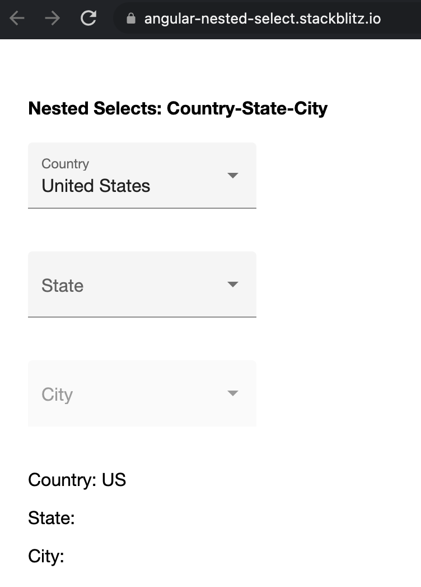

# Angular Nested Selects

Example demonstrating nested selects (Reactive Forms) using Countries, States and Cities. State field is disabled until a country is selected. City field is disabled until a state is selected.

[Edit on StackBlitz ⚡️](https://stackblitz.com/edit/angular-nested-select)

  

